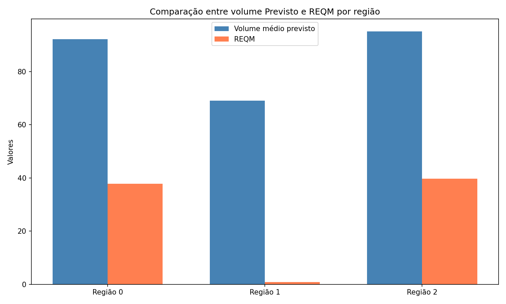
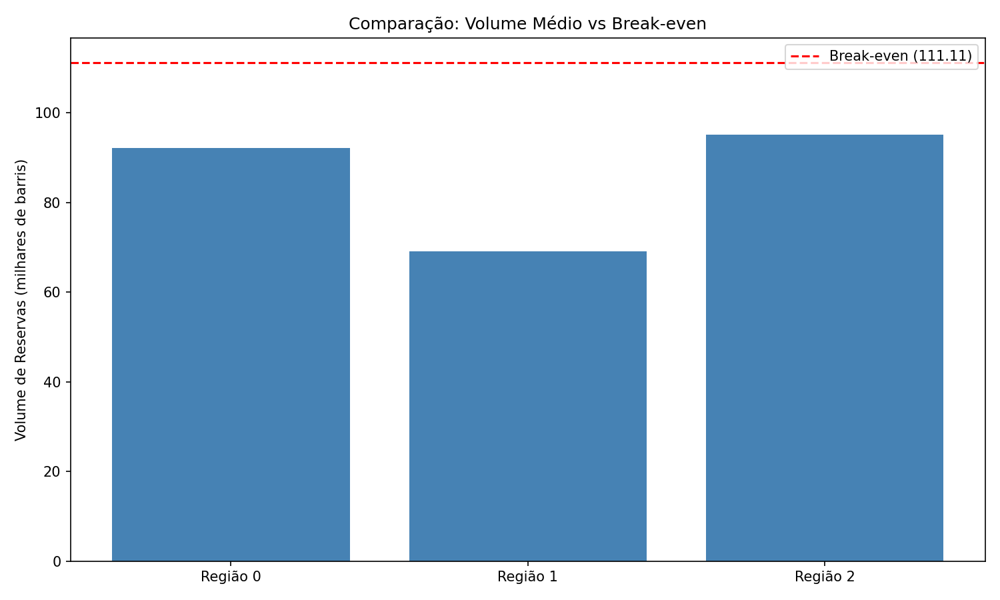
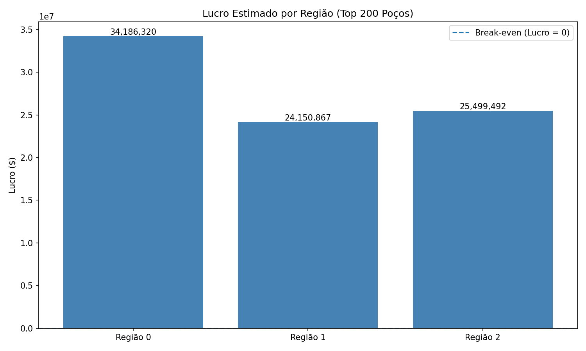
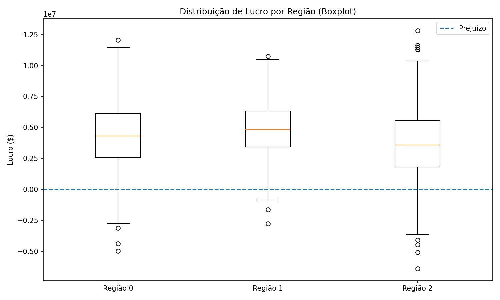

# Seleção de Regiões para Perfuração de Poços de Petróleo

[](https://www.python.org/)
[](https://scikit-learn.org/)
[](https://github.com/seu-usuario/oilygiant-project)

---

## Sobre o Projeto

Este projeto tem como objetivo identificar a melhor região para perfuração de novos poços de petróleo para a empresa **OilyGiant**, utilizando técnicas de **Machine Learning** e análise estatística.

A decisão é orientada por dois pilares fundamentais:

- **Maximização do lucro**
- **Minimização do risco**

---

## Objetivo

Selecionar a região com **maior retorno financeiro**, respeitando os critérios:

- Risco de prejuízo inferior a **2,5%**
- Maior lucro médio entre as regiões seguras

---

## Estrutura dos Dados

Cada dataset contém informações geológicas dos poços:

| Coluna       | Descrição                               |
| ------------ | --------------------------------------- |
| `id`         | Identificador do poço                   |
| `f0, f1, f2` | Características geológicas              |
| `product`    | Volume de reservas (milhares de barris) |

---

## Pipeline do Projeto

```
Dados → Pré-processamento → Regressão Linear → Predições → 
Seleção Top 200 → Cálculo de Lucro → Bootstrapping → Decisão Final
```

## Metodologia

### 1. Preparação dos Dados

- Verificação de inconsistências
- Padronização dos dados (StandardScaler)

### 2. Modelagem

- Modelo: **Regressão Linear**
- Divisão: **75% treino / 25% validação**
- Métrica: **RMSE (REQM)**

### 3. Regras de Negócio

- Investimento total: **$100 milhões**
- Poços selecionados: **200**
- Receita por unidade: **$4.500**
- Break-even (ponto de equilibrio): **~111 unidades por poço**

### 4. Cálculo de Lucro

- Seleção dos **200 melhores poços** com base nas predições
- Cálculo do lucro utilizando os valores reais (`target`)

### 5. Análise de Risco (Bootstrapping)

- 1000 simulações com reposição
- Estimativa de:
  - lucro médio
  - intervalo de confiança (95%)
  - risco de prejuízo

---

## Resultados

| Região   | Lucro Médio | Intervalo de Confiança 95% | Risco     |
| -------- | ----------- | -------------------------- | --------- |
| Região 0 | $4.44M      |      [-1.08M, 9.67M]       | 4.90%     |
| Região 1 | **$4.93M**  |      [1.01M, 9.02M]        | **0.80%** |
| Região 2 | $3.41M      |      [-1.98M, 9.00M]       | 10.40%    |

---

## Visualizações

Foram utilizadas três abordagens principais:

- Intervalo de confiança → suporte à decisão
- Boxplot → análise de dispersão e risco
- Distribuição de lucro → comportamento dos cenários

### Gráficos do Projeto

#### 1. Comparação: Volume Médio vs REQM por Região



*Este gráfico compara o volume médio previsto com o erro quadrático médio (REQM) para cada região.*

---

#### 2. Comparação: Volume Médio vs Break-even



*Gráfico comparando o volume médio previsto de cada região com o ponto de equilíbrio (break-even).*

---

#### 3. Lucro Estimado por Região (Top 200 Poços)



*Lucro estimado para cada região considerando os 200 poços com maior potencial.*

---

#### 4. Distribuição de Lucro por Região (Boxplot)



*Boxplot mostrando a distribuição dos lucros simulados por região. A linha tracejada indica o ponto de prejuízo.*

---

> **Nota:** Os gráficos acima são gerados automaticamente ao executar o notebook [project.ipynb](notebook/project.ipynb).

---

## Resultado Final

> **Região 1 selecionada**

### Justificativa:

- Maior lucro médio esperado
- Intervalo de confiança totalmente positivo
- Menor risco de prejuízo (**0,80%**)

---

## Principais Insights

- A Média geral não é suficiente para a tomada de decisão, sendo os **melhores poços (top 200)** que determinam o lucro das regiões mais lucrativas, mas que podem esconder alto risco. Sendo assim, o **Bootstrapping** é essencial para decisões robustas

---

## Tecnologias Utilizadas

- Python
- Pandas
- NumPy
- Scikit-learn
- Matplotlib

---

## Como Executar

```bash
# Clone o repositório
git clone https://github.com/seu-usuario/mineracao_project.git

# Acesse a pasta
cd mineracao_project

# Crie um ambiente virtual (opcional)
python -m venv venv
source venv/bin/activate  # Linux/Mac
# ou
venv\Scripts\activate  # Windows

# Instale as dependências
pip install -r requirements.txt

# Execute o notebook
jupyter notebook notebook/project.ipynb
```
